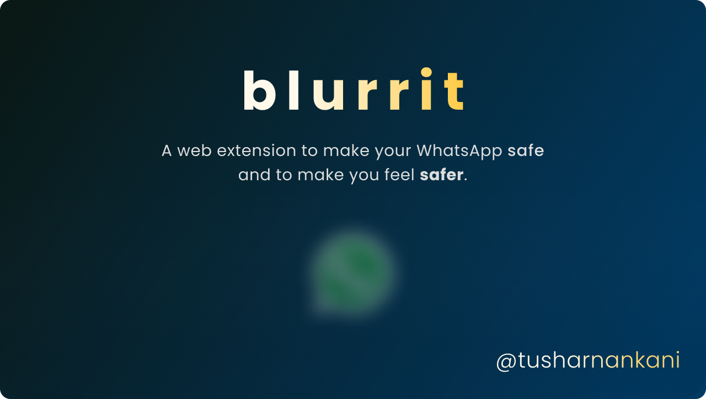
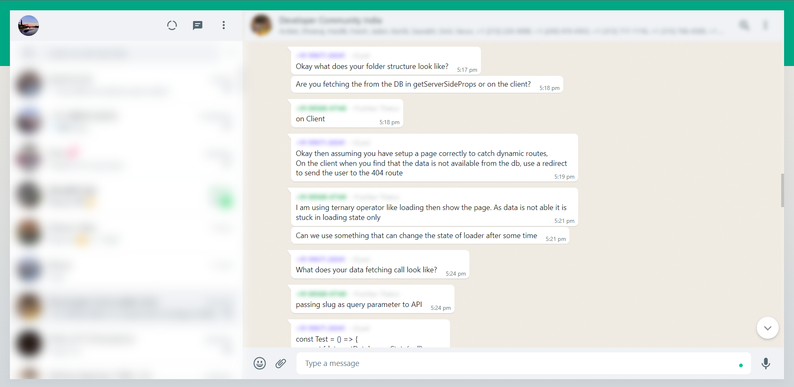
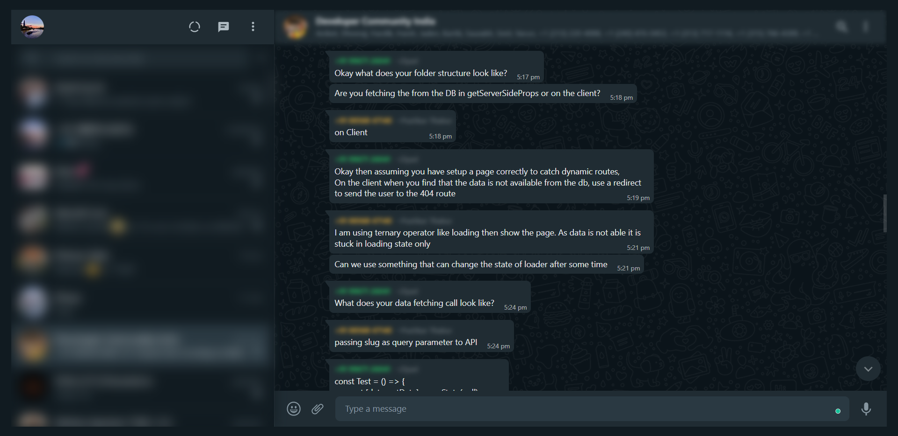

 

  
     

  Built with <a src="https://figma.com">Figma</a>.

 

   
  <a href="#table-of-content"><b>Explore the docs »</b></a>
   
   
  <a href="#features">Features</a>
  &nbsp;&nbsp;·&nbsp;&nbsp;
  <a href="#motivation">Motivation</a>
  &nbsp;&nbsp;·&nbsp;&nbsp;
  <a href="#local-setup">Local Setup</a>
   

 

### Table of Content

- [Table of Content](#table-of-content)
- [Features](#features)
- [Extension in Action](#extension-in-action)
- [Motivation](#motivation)
- [Local Setup](#local-setup)

Read the [Privacy Statement](privacy).

 

### Features

- Blurs the list of chats (Left side) of the WhatsApp Web view.
- Blurs the WhatsApp Chat Name of the message.
- Blurs the WhatsApp Author Name of the message.
- Momentarily un-blurs on hovering the blurred regions.
- Toggles blur on clicking the extension.

### Extension in Action

**Blurs onLoad**

<table>
    <tr>
        <td>
            
        </td>
    </tr>
    <tr>
      <td>
            
      </td>
    </tr>
</table>

 

**Major UX Update**:

- All of the [potential enhancements](https://github.com/tusharnankani/blurrit/issues/4) expect a toggle button/checkbox for customizations.
- Came up with a better fix — Removing the click overall (UX 101)
- Now, if you'll just hover on the blurred region; you will be able to momentarily see the hovered plus blurred region.

**Simple OnClick Toggle**:

- Click on the extension to toggle the blur.

**Keyboard Shortcut (Hot-Key) Toggle**

Use the shortcut to toggle the blur.
- Windows: `Ctrl` + `Shift` + `Z`
- Mac: `Command` + `Shift` + `Z`

lowkey proud of the alignment and accessibility of these keys.

 

### Motivation

- Ever felt your privacy invaded when you are logged into WhatsApp Web when you are sharing your screen in a meet or on a projector?
- Or are there times when someone is sitting beside you and sees your WhatsApp chats or who you have been texting?
- Or are there times when you want to share a screenshot with the names hidden?

Moreover, the fact that when I went to look for a solution, found [the perfect one](https://wawplus.com) to be paid. So, why not build one for free?

Also, wanted to build <strike>an extension</strike> desparately.

 

### Local Setup

- Clone the [repository](https://github.com/tusharnankani/blurrit) or [download the zipped file](https://github.com/tusharnankani/blurrit/archive/refs/heads/main.zip).

 
Downloading Extension

   
  

 

- Unzip it by right clicking on `blurrit-main` (in your downloads)
- And then clicking on `Extract All`.

 
Unzipping the download

   
  

 

- Extensions can be [loaded in unpacked mode](https://developer.chrome.com/extensions/getstarted#unpacked) by following the following steps.
- Visit `chrome://extensions` or `edge://extensions` (via menu -> Tools -> Extensions).
- `Enable Developer mode` by ticking the checkbox.

 
Enabling Developer Mode

   
  
  

 

- Click on the `Load unpacked extension` button.
- Select the locally cloned repository or the unzipped folder (`blurrit-main` in this case) which has `manifest.json` in the root to unpack the extension.

 
Selecting the folder

   
  
  
Selecting after unzipping the folder.

  
  
Or selecting after cloning the repository.

  
   

 
  
- Visit [web.whatsapp.com](https://web.whatsapp.com); because **blurrit** is ready to use.

 
Built with <strike>sweat, blood and love</strike> JavaScript, by <a href="https://tusharnankani.github.io">Tushar Nankani.</a>
